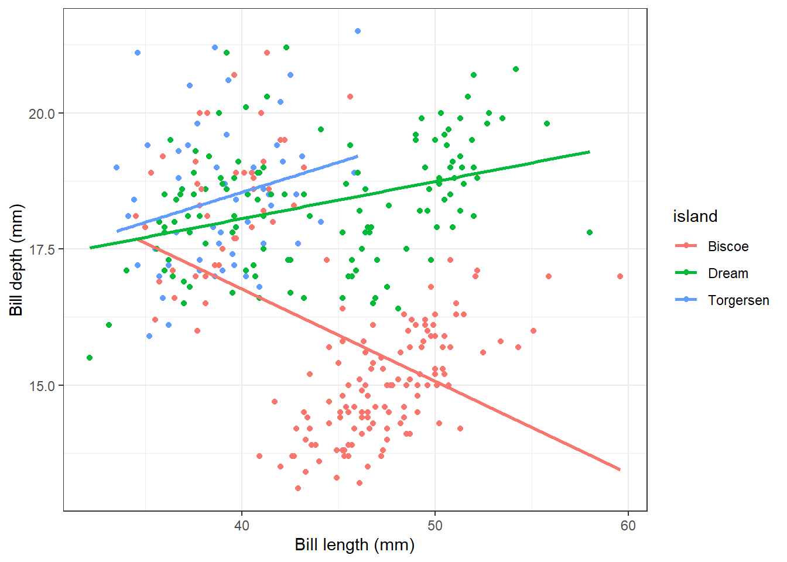

## Trying things


Let's make a graph.


::: {.cell}

```{.r .cell-code}
penguins |>
  select(bill_len, bill_dep, island) |>
  na.omit() |>
  ggplot() +
  aes(x = bill_len, y = bill_dep, color = island) +
  geom_point() +
  geom_smooth(method = "lm", se = FALSE) +
  theme_bw() +
  labs(
    x = "Bill length (mm)",
    y = "Bill depth (mm)"
  )
```

::: {.cell-output .cell-output-stderr}
```
`geom_smooth()` using formula = 'y ~ x'
```
:::

::: {.cell-output-display}
{width=672}
:::
:::
